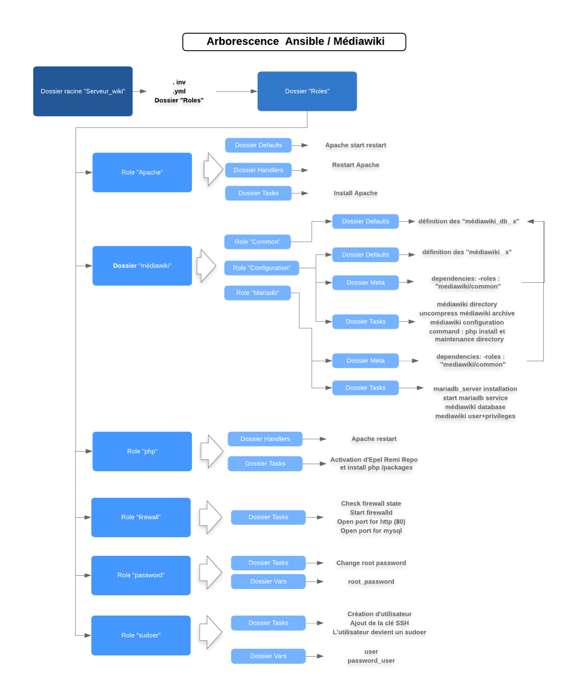

# <b><u> Déploiement automatique d'un serveur Wikimédia </u></b>
## <u>Introduction </u>

Wikimédia est une marque de la Wikimedia Foundation et un mouvement soutenu. 
Dans ce mouvement, certains projets telsque Wikipédia, s'organisent en ligne. D'autres d'organisent hors ligne.


____

- Schéma de déploiement automatique Ansible/Mediawiki:  



---
## <u> 1) Les différents rôles: </u>

Dans notre cas, où l'on souhaite ` déployer automatiquement ` le serveur Apache, sudoer (création / modification de mot de passe), le firewall D et le Wikimédia.

<u>Pour cela, on crée un rôle par étape:</u>

- Sudoer
- Password
- Apache
- php
- Firewall
- Wikimédia
    - common
    - configuration
    - mariadb

Chaque rôle a un playbook qui sera appelé dans un fichier `.sh ` afin d'être exécuté.
<br>

---


## <u> 2) Playbook et inventaire des différents rôles: </u>
### <i>2.1 - Deux groupes d'exécutions: </i>
Deux inventaires, - répertoriant les machines utilisées (classées par groupe) -, seront créés et utilisés selon le playbook, car les 1eres exécutions sont des prérequis aux 3 autres. Chaque exécution est un prérequis à celle qui la suit.

<b><u>- 1er groupe d'exécution:</u></b>
- Changer le Password du root:
    - playbook_password.yml
    - inventory_sudo.inv
- Création d'un Sudoer :
    - playbook_sudo.yml  
    - inventory_sudo.inv

```
# Liste des machines
[sudoer]
    server_apache ansible_user=root 
```
<br>

<b><u>- 2eme groupe d'exécution: </u></b>
- Installation Apache: 
    - playbook_apache.yml
    - wiki.inv
- Installion Firewall:
    - playbook_firewall.yml
    - wiki.inv
- Installation Mediawiki:
    - playbook.yml
    - wiki.inv

```
# Liste des machines
[sudoer]
    vps646618.ovh.net ansible_user=root

[apache]
    vps646618.ovh.net ansible_user=ansibleuser

[apache:vars]
    php_install=yes

[mysql]
    vps646618.ovh.net ansible_user=ansibleuser
```
<br>

### <i>2.2 - Composition principale des playbooks: </i>

#### 2.2.1 -  1er groupe d'exécution de playbook:

* Le playbook password permet de changer le mot de passe du root à sa première connexion, en appelant le rôle "password":

```
- name: Change root password
  hosts: sudoer
  become: yes
  roles:
   - role: "password"
```

* Le playbook sudoer créer et donne les droits root à un super utilisateur en appelant le rôle "sudoer": 

```
- name: "Apache Installation"
# envoie à toutes les machines du .inv 
  hosts: sudoer
# remote_user définit l'utilisateur utilisé
  remote_user: root 
# récupère les données des hosts
  gather_facts: yes
  roles:
   - role: "sudoer"
```


#### 2.2.2 - 2ème groupe d'exécution de playbook:

* Le playbook apache installe à la fois apache et le module php en appelant les rôles "apache" et "php":

```
- name: "Installation Apache"
  hosts: apache
  roles:
   - role: "apache"
   - role: "php"
   ```

* Le playbook firewall permet d'installer FirewallD en passant par le port 80 et en utilisant le serveur apache précédemment installer et en se connectant via le user créé lors de l'installation d'Apache, en appelant le rôle "firewall":

```
- name: "Start firewalld and Open port 80"
  hosts: server_apache
  remote_user: ansibleuser
  gather_facts: yes
  roles: 
   - role: "firewall"
```

* Le playbook mediawiki permet d'installer un serveur wikimédia sur la machine distante en appelant le rôle "mediawiki":

```
- name: "MediaWiki db configuration"
  hosts: mysql
  gather_facts: no
  tags: [ "mariadb", "mysql" ]
  roles:
  - role: "mediawiki/mariadb"
- name: "MediaWiki apache configuration"
  hosts: apache
  tags: "apache"
  gather_facts: no
  roles:
   - role: "mediawiki/configuration"
```
<br>

---


## <u>3) Appel des playbooks et exécution des rôles: </u>
<u>Fichier bash .sh :</u>

```
#bin!/bash

ansible-playbook -b -i inventory_sudo.inv playbook_password.yml -ssh-common-args='-o StrictHostKeyChecking=no' && \
ansible-playbook -b -i inventory_sudo.inv playbook_sudo.yml -ssh-common-args='-o StrictHostKeyChecking=no' && \

ansible-playbook -b -i wiki.inv playbook_apache.yml -ssh-common-args='-o StrictHostKeyChecking=no' && \
ansible-playbook -b -i wiki.inv playbook_firewall.yml -ssh-common-args='-o StrictHostKeyChecking=no' && \
ansible-playbook -b -i wiki.inv playbook_mediawiki.yml -ssh-common-args='-o StrictHostKeyChecking=no'
```

L'instruction '<i> -ssh-common-args='-o StrictHostKeyChecking=no' </i>' permet de passer le check d'installation (passer le "yes or no" à entrer).


Puis il faut exécuter le fichier dans le prompt:
```
./fichier_playbook.sh
```

Les playbooks seront exécutés les uns après les autres. Si une erreur se produit lors d'une des exécutions de playbook, l'exécution globale s'arrête.
